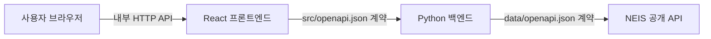

# 급식 배틀 - 학교 급식 조회 앱 TRD

## 1. 문서 목적

이 문서는 `PRD.md`의 요구사항을 구현하기 위한 기술 설계와 검증 기준을
정의한다. 애플리케이션은 React 프론트엔드와 Python 백엔드로 분리하고 Docker
Compose로 함께 빌드하고 실행한다.

## 2. 기술 원칙

- 브라우저는 백엔드 API만 호출하며 NEIS API를 직접 호출하지 않는다.
- 저장소의 `data/openapi.json`을 NEIS 외부 API 계약의 기준으로 사용한다.
- 구현 단계에 `src/openapi.json`을 생성해 프론트엔드와 백엔드 사이의 내부 API
  계약을 정의한다.
- 외부 NEIS 모델과 내부 API 모델을 분리해 외부 응답 형식의 변경이 UI로
  전파되지 않게 한다.
- NEIS API 인증키는 백엔드 런타임 환경 변수로만 주입한다.

## 3. 시스템 구성



| 구성 요소 | 책임 |
|---|---|
| React 프론트엔드 | 3단계 UI, 입력 검증, 요청 상태 관리, 결과 및 오류 표시 |
| Python 백엔드 | 내부 API 제공, 입력 재검증, NEIS 호출, 응답 검증·변환, 오류 매핑 |
| NEIS 클라이언트 | `data/openapi.json`에 따른 쿼리 구성과 응답 파싱 |
| Docker Compose | 프론트엔드와 백엔드의 빌드, 네트워크 연결 및 환경 구성 |

## 4. 권장 기술 스택

| 영역 | 기술 |
|---|---|
| 프론트엔드 | React, TypeScript, Vite |
| 백엔드 | Python, FastAPI, Pydantic, 비동기 HTTP 클라이언트 |
| API 계약 | OpenAPI 3.x (`data/openapi.json`, `src/openapi.json`) |
| 오케스트레이션 | Docker, Docker Compose |
| 테스트 | 프론트엔드 통합 테스트 러너, Python 테스트 러너, 브라우저 E2E 테스트 러너 |

테스트 도구의 구체적인 패키지는 구현 시 선택하되, 아래 테스트 경계와 범위를
유지해야 한다.

## 5. 디렉터리 설계

구현 단계에서는 다음 구조를 사용한다. 이 문서 작업에서는 해당 파일이나
디렉터리를 생성하지 않는다.

```text
.
├── data/
│   └── openapi.json          # NEIS 외부 API 계약
├── src/
│   ├── openapi.json          # 프론트엔드-백엔드 내부 API 계약
│   ├── frontend/             # React 애플리케이션
│   └── backend/              # Python 애플리케이션
├── tests/
│   └── e2e/                  # 전체 사용자 흐름 테스트
└── compose.yaml
```

프론트엔드와 백엔드 각각에는 외부 계약 또는 내부 계약을 호출하는 전용 클라이언트
모듈을 두고, 화면 컴포넌트나 라우트 처리기에서 직접 HTTP 요청을 조립하지 않는다.

## 6. API 계약

### 6.1 NEIS 외부 API

백엔드의 NEIS 클라이언트는 `data/openapi.json`을 기준으로 다음 작업을 수행한다.

| 목적 | NEIS 작업 | 주요 입력 |
|---|---|---|
| 학교 검색 | `GET /schoolInfo` (`getSchoolInfo`) | `SCHUL_NM`, 인증키, JSON 형식, 페이지 |
| 중식 조회 | `GET /mealServiceDietInfo` (`getMealServiceDietInfo`) | 교육청 코드, 학교 코드, 중식 코드, 시작일, 종료일 |

- 학교 검색 결과에서 급식 조회에 필요한
  `ATPT_OFCDC_SC_CODE`와 `SD_SCHUL_CODE`를 보존한다.
- 급식 조회 날짜는 `YYYYMMDD` 형식의 `MLSV_FROM_YMD`와 `MLSV_TO_YMD`로
  전달한다.
- 중식만 조회하도록 NEIS의 식사 구분 코드 또는 응답의 식사 구분을 사용해
  제한한다.
- 인증키, `Type=json`, 페이지 번호 및 페이지 크기는 클라이언트 계층에서
  일관되게 설정한다.
- 페이지 크기 제한을 지키고 결과가 한 페이지를 넘을 수 있는 요청은 전체 결과를
  반환하도록 페이지를 순차 조회한다.
- HTTP 상태 코드뿐 아니라 HTTP 200의 `RESULT` 업무 오류도 검사한다.
- 외부 응답은 `data/openapi.json` 스키마에 따라 런타임 검증한 뒤 내부 모델로
  변환한다.

### 6.2 프론트엔드-백엔드 내부 API

구현 시 `src/openapi.json`에 최소 다음 작업과 스키마를 정의한다.

#### 학교 검색

```http
GET /api/schools?query={부분 학교명}
```

성공 응답의 각 학교는 다음 정보를 포함한다.

| 필드 | 형식 | 설명 |
|---|---|---|
| `educationOfficeCode` | string | 급식 조회에 사용할 교육청 코드 |
| `schoolCode` | string | 학교 행정표준코드 |
| `name` | string | 학교명 |
| `educationOfficeName` | string 또는 null | 동명 학교 구분용 교육청명 |
| `location` | string 또는 null | 동명 학교 구분용 소재지 |
| `schoolType` | string 또는 null | 학교 종류 |

#### 중식 조회

```http
GET /api/schools/{educationOfficeCode}/{schoolCode}/meals?from={YYYY-MM-DD}&to={YYYY-MM-DD}
```

성공 응답은 학교 정보와 급식 목록을 포함하며, 각 급식 항목은 다음 정보를
포함한다.

| 필드 | 형식 | 설명 |
|---|---|---|
| `date` | `YYYY-MM-DD` | 급식일 |
| `mealType` | string | 중식 식사 구분 |
| `menu` | string 배열 | 표시 가능한 메뉴 목록 |
| `calories` | string 또는 null | NEIS가 제공한 열량 정보 |
| `nutrition` | string 또는 null | NEIS가 제공한 영양 정보 |
| `origin` | string 또는 null | NEIS가 제공한 원산지 정보 |
| `headcount` | number 또는 null | NEIS가 제공한 급식인원수 |

응답 목록은 날짜 오름차순으로 정렬한다. 선택 기간에 중식이 없으면 성공 응답과
빈 목록을 반환해 시스템 오류와 구분한다.

#### 오류 모델

모든 내부 API 오류는 최소한 다음 구조로 통일한다.

```json
{
  "code": "INVALID_DATE_RANGE",
  "message": "시작일은 종료일보다 늦을 수 없습니다."
}
```

`src/openapi.json`에는 성공, 입력 오류, 찾을 수 없음, 요청 제한 및 외부 서비스
실패 응답을 명시한다.

## 7. 데이터 흐름

### 7.1 학교 검색

1. 프론트엔드는 검색어의 앞뒤 공백을 제거하고 빈 값인지 검사한다.
2. 프론트엔드는 내부 학교 검색 API를 호출한다.
3. 백엔드는 검색어를 다시 검증하고 NEIS 학교정보 API를 호출한다.
4. 백엔드는 NEIS의 HTTP 응답과 `RESULT`를 검증한다.
5. 백엔드는 학교 응답을 내부 스키마로 변환해 반환한다.
6. 프론트엔드는 결과, 빈 상태 또는 오류 상태를 표시한다.

### 7.2 중식 조회

1. 프론트엔드는 선택한 학교 코드와 시작일·종료일을 전달한다.
2. 백엔드는 학교 코드, 날짜 형식 및 `from <= to` 조건을 검증한다.
3. 백엔드는 날짜를 `YYYYMMDD`로 바꾸고 NEIS 급식 API에 중식 조건으로
   요청한다.
4. 백엔드는 응답을 검증하고 메뉴 줄바꿈을 항목 배열로 정규화한다.
5. 백엔드는 날짜 오름차순의 내부 급식 모델을 반환한다.
6. 프론트엔드는 날짜별 카드 또는 목록으로 결과를 표시한다.

프론트엔드는 요청 취소 또는 최신 요청 식별을 적용해 늦게 도착한 이전 응답이
새로운 검색이나 조회 결과를 덮어쓰지 않도록 한다.

## 8. 프론트엔드 설계

- 화면은 `학교 검색`, `날짜 선택`, `결과 표시`의 세 단계 영역으로 구성한다.
- 학교를 선택하기 전에는 날짜 조회 단계의 실행을 비활성화한다.
- 학교가 변경되면 기존 날짜별 결과를 초기화한다.
- 입력 오류, 로딩, 빈 결과 및 서버 오류를 서로 다른 명시적 상태로 관리한다.
- API 접근은 `src/openapi.json` 계약을 따르는 전용 클라이언트에서 수행한다.
- NEIS 인증키나 NEIS 엔드포인트를 프론트엔드 환경 변수 또는 번들에 포함하지
  않는다.

## 9. 백엔드 설계

- API 라우트 계층은 입력 검증과 HTTP 응답 매핑을 담당한다.
- 서비스 계층은 학교 검색 및 중식 조회 유스케이스를 담당한다.
- NEIS 클라이언트 계층은 `data/openapi.json` 기반 요청과 응답 검증을 담당한다.
- 인증키는 필수 환경 변수로 읽으며, 누락 시 애플리케이션 시작 실패로 명확히
  드러내야 한다.
- 외부 호출에는 유한한 연결 및 응답 제한 시간을 설정한다.
- 인증 실패, 요청 제한, NEIS 업무 오류, 네트워크 실패 및 응답 스키마 오류를
  구분해 내부 오류로 매핑한다.
- 정상적인 `데이터 없음` 응답은 빈 목록으로 변환하고 장애로 기록하지 않는다.
- 로그에 인증키, 전체 요청 URL의 비밀값 또는 민감한 헤더를 남기지 않는다.

## 10. Docker Compose 설계

- `frontend`와 `backend` 두 서비스를 각각 별도 Dockerfile로 빌드한다.
- 두 서비스는 Compose의 전용 네트워크에서 서비스 이름으로 통신한다.
- 브라우저가 접근할 프론트엔드 포트만 기본 공개하고, 개발상 필요한 경우에만
  백엔드 포트를 호스트에 공개한다.
- 백엔드 서비스에 NEIS 인증키를 환경 변수로 주입하되 Compose 파일에 실제
  비밀값을 저장하지 않는다.
- 프론트엔드가 사용하는 내부 API 기본 주소는 개발 및 컨테이너 실행 환경에 맞게
  구성한다.
- 백엔드 준비 상태를 확인하는 헬스체크를 정의하고 프론트엔드 시작 의존성에
  반영한다.
- 한 번의 Compose 명령으로 두 서비스를 빌드·실행하고, 종료 시 두 서비스와
  네트워크를 함께 정리할 수 있어야 한다.

## 11. 오류 처리

| 상황 | 백엔드 처리 | 프론트엔드 처리 |
|---|---|---|
| 빈 학교 검색어 | 요청 거부 | 필드 오류 표시 |
| 잘못된 날짜 형식 또는 범위 | 4xx와 안정적인 오류 코드 반환 | 날짜 입력 옆에 수정 안내 |
| 학교 검색 결과 없음 | 200과 빈 목록 | 검색 결과 없음 표시 |
| 중식 정보 없음 | 200과 빈 급식 목록 | 해당 기간 정보 없음 표시 |
| NEIS 인증 실패 | 외부 오류를 내부 서비스 오류로 매핑하고 비밀값 없이 기록 | 서비스 이용 불가 안내 |
| NEIS 요청 제한 | 재시도 가능한 오류로 매핑 | 잠시 후 재시도 안내 |
| NEIS HTTP 200 업무 오류 | `RESULT` 코드 검사 후 오류 또는 빈 결과로 분류 | 분류된 상태에 맞게 표시 |
| 시간 초과 또는 비정상 응답 | 명시적 외부 서비스 오류 반환 | 기존 결과와 분리해 재시도 표시 |

## 12. 테스트 전략

### 12.1 프론트엔드 통합 테스트

프론트엔드는 컴포넌트 단위 테스트 대신 사용자 관점의 통합 테스트만 작성한다.
내부 API는 네트워크 경계에서 모킹하고 다음을 검증한다.

- 부분 학교명 입력, 검색 실행, 여러 결과 표시 및 학교 선택
- 검색 결과 없음과 검색 실패 상태
- 학교 미선택 또는 잘못된 날짜 범위에서 조회 차단
- 유효한 날짜 범위 조회와 날짜별 중식 렌더링
- 중식 정보 없음, 조회 실패 및 재시도 상태
- 학교 변경 시 이전 결과 초기화
- 늦게 도착한 이전 응답이 최신 결과를 덮어쓰지 않음

### 12.2 백엔드 단위 테스트

NEIS HTTP 호출을 모킹하고 다음을 검증한다.

- 입력 날짜 변환과 범위 검증
- 학교 검색 및 중식 요청 파라미터 구성
- 학교 및 급식 외부 모델의 내부 모델 변환
- 메뉴 줄바꿈 정규화와 날짜 정렬
- HTTP 200 `RESULT` 업무 오류 판별
- 빈 결과, 인증 실패, 요청 제한, 시간 초과 및 비정상 스키마의 오류 매핑
- 여러 페이지 결과 병합

### 12.3 백엔드 통합 테스트

백엔드 애플리케이션과 모킹된 NEIS 서버를 HTTP로 연결해 다음을 검증한다.

- `src/openapi.json`의 학교 검색 및 중식 조회 성공 응답
- 입력 오류의 상태 코드와 공통 오류 스키마
- NEIS 성공, 빈 결과 및 업무 오류 응답의 종단 간 변환
- 실제 NEIS API나 실제 인증키에는 의존하지 않음

### 12.4 E2E 테스트

Docker Compose로 프론트엔드와 백엔드를 실행하고, 제어 가능한 NEIS 대역 또는
테스트 픽스처를 사용해 다음 전체 흐름을 검증한다.

1. 부분 학교명으로 검색한다.
2. 검색 결과에서 학교를 선택한다.
3. 유효한 날짜 범위를 선택한다.
4. 조회를 실행한다.
5. 날짜별 중식 메뉴가 표시되는지 확인한다.

별도 시나리오로 학교 검색 결과 없음, 잘못된 날짜 범위 및 중식 정보 없음을
검증한다. E2E 테스트에서도 실제 비밀 인증키와 외부 서비스 상태에 의존하지
않는다.

## 13. 추적성

| PRD 요구사항 | 기술 구현 및 검증 |
|---|---|
| FR-1 학교 검색 | 내부 학교 검색 API, NEIS `schoolInfo` 클라이언트, 프론트 통합·백엔드 테스트 |
| FR-2 날짜 범위 선택 | 양쪽 계층 입력 검증, 공통 오류 모델, 통합·E2E 테스트 |
| FR-3 중식 조회 | 내부 중식 API, NEIS `mealServiceDietInfo` 클라이언트, 중식 필터와 날짜 정렬 |
| FR-4 상태 및 오류 안내 | 명시적 UI 상태, NEIS 오류 매핑, 실패 경로 테스트 |
| 인증키 비노출 | 브라우저-백엔드 분리, 백엔드 환경 변수 주입 |
| 표준 실행 절차 | 두 서비스의 Dockerfile과 Docker Compose 구성 |

